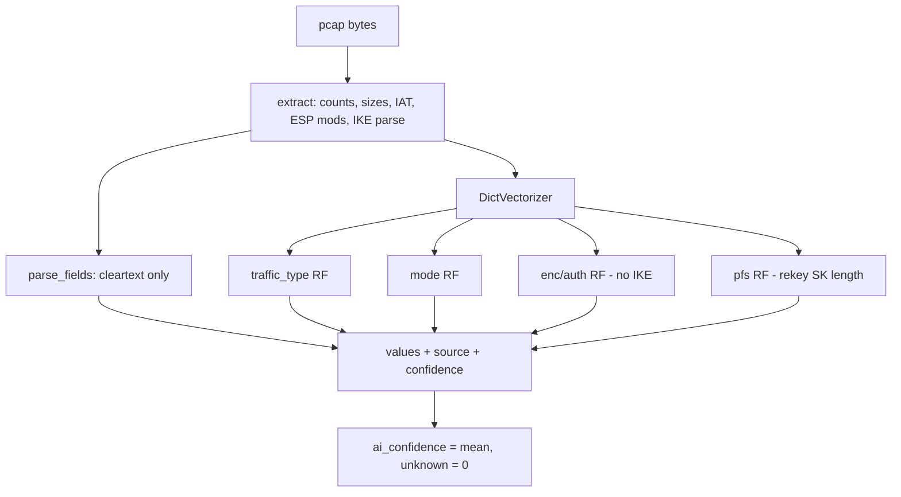

# Architecture

Mermaid sources (no renderer in this env — paste into any Mermaid viewer;
PNG export intentionally not committed).

## Pipeline

```mermaid
flowchart LR
    M[testbed/matrix.py] --> C[configs + labels]
    C --> T[netns testbed + live_gen]
    T --> R[data/real 66 pcaps]
    M --> S[capture/synth/synth_pcap.py]
    S --> Y[data/pcaps/synth 360 pcaps]
    R --> V[capture/validate_pcap.py]
    Y --> V
    V --> MAN[data/manifest.csv]
    MAN --> F[engine/features/extract.py]
    F --> P[parsed fields]
    F --> ML[RF models]
    P --> A[analyze()]
    ML --> A
    A --> AS[assess()]
    A --> API[FastAPI + CLI + PDFs]
```

## Classifier data flow



## Trust boundaries

- Packet bytes cross into `extract()`; labels/filenames/manifest never do
  (tested by hiding `data/labels`).
- Deterministic keys derive ESP/AH/IKE decryption for SYNTHETIC captures
  only; real captures are structurally validated, never decrypted.
- `unknown` is a first-class output, counted as an error in evaluation.
```

## Component map

| Path | Role | Reads labels? |
|---|---|---|
| `testbed/matrix.py` | variant ground truth | n/a (defines them) |
| `capture/synth/` | synthetic pcaps + labels | writes them |
| `capture/validate_pcap.py` | gate (incl. decrypt synthetic) | yes, to verify |
| `capture/audit_leakage.py` | leakage gate | manifest only |
| `engine/features/` | bytes-only features | NEVER |
| `engine/classifier/` | parse + RF + analyze | train/eval only as targets |
| `engine/eval/` | grouped CV, ablations, reports | yes, as targets |
| `engine/assess/` | rubric scores | no (takes classification) |
| `engine/api/`, `cli/`, `reports/` | serving | no |
